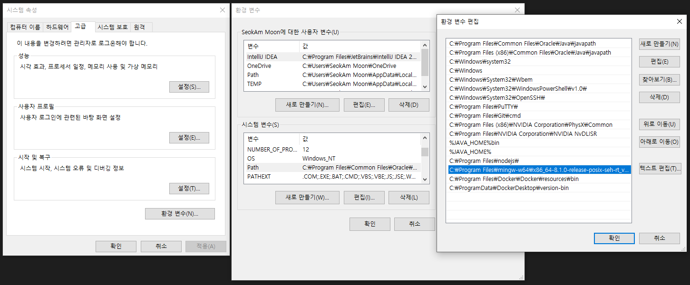

<details>
<summary>출처 및 참고</summary>
  <a href="https://oziguyo.tistory.com/34"> https://oziguyo.tistory.com/34 기본 설정</a>
  <br>
  <a href="https://jhnyang.tistory.com/430"> https://jhnyang.tistory.com/430 디버그 설정 </a>
</details>


## 서론

과거에 C/C++ 을 사용할 때는 항상 Visual Studio 를 사용했지만 지금 사용하려 보니 너무 무거웠다.

특히 알고리즘 문제 간단하게 하나 풀려고 하는데 Visual Studio를 깔기엔 더더욱 부담이였다.

자주 사용할 예정이 아니기에 VSCode에서 간단하게 구동할 생각으로 찾아본 자료이다.


## 1. C/C++ 컴파일러

- Mingw 사용 예정 ( <https://www.mingw-w64.org/> )
  - Sourceforge 다운로드 링크 ( <https://sourceforge.net/projects/mingw-w64/files/mingw-w64/mingw-w64-release/> )

<br/>


<br/>

## 2. Mingw 설치

- Sourceforge 사이트에서 Online Installer 설치 받기
  - 단 오류 발생시 해당 설정 파일을 따로 설치 받아서 폴더에 넣어주기
  - 일반적인 기본 위치 ( `C:\Program Files\mingw-w64\[설치받은 파일]` )


- 설치 Setting 에서 Architecture 만 x86 64 로 변경해주기


<br/>

## 3. 환경변수 등록하기

- Path 에 `C:\Program Files\mingw-w64\x86_64-8.1.0-posix-seh-rt_v6-rev0\mingw64\bin` 경로 추가하기



- cmd 에서 다음 확인하기 ( 설치 버전이랑 동일했는지 확인하기 )
  ```bash
  gcc -v
  g++ -v
  ```


<br/>

## 4. VSCode Extension 설치

- C/C++ 설치
  - extension pack 설치해도 괜찮은듯


<br/>

## 5. VSCode 컴파일러 경로 설정

- Ctrl + Shtft + P → C/C++ 입력


- `C/C++ Edit Configurations` 에서 컴파일 경로( 환경변수 경로 + `gcc` or `g++` ) 설정하기
  - gcc 와 g++ 는 다르다. ( 참고 링크 : <https://hsunnystory.tistory.com/112> )
  - 일반적으로 C 사용시 `gcc`, C++ 사용시 `g++`


- `IntelliSense` 모드 gcc-x64 ( window-gcc-x64 ) 로 선택


<br/>

## 6. (필요시) VSCode 단축키 설정

- File -> Preferences ->Keyboard Shortcuts 경로에서 Json으로 열기 후 아래 Json 설정 추가하기

  ```json
  [
      { "key": "ctrl+shift+b", "command": "workbench.action.tasks.build" },
      
      { "key": "ctrl+shift+t", "command": "workbench.action.tasks.test" }
  ]
  ```

  - Ctrl + Shtft + B 컴파일 및 빌드
  - Ctrl + Shtft + T 실행

<br/>

## 7. 코드 컴파일 및 실행 설정

- Terminal -> Configure Default Build Task 클릭 후
- `Create tasks.json from template` 클릭
- `Othres` 클릭
- 생성된 `tasks.json` 파일 아래 코드로 수정

  ```json
  {
      "version": "2.0.0",
      "runner": "terminal",
      "type": "shell",
      "echoCommand": true,
      "presentation": {
          "reveal": "always"
      },
      "tasks": [
  				// c++ 컴파일
          {
              "label": "save and compile for C++",
              "command": "g++",
              "args": [
                  "${file}",
                  "-o",
                  "${fileDirname}/${fileBasenameNoExtension}"
              ],
              "group": "build",
              "problemMatcher": {
                  "fileLocation": [
                      "relative",
                      "${workspaceRoot}"
                  ],
                  "pattern": {
                      "regexp": "^(.*):(\\d+):(\\d+):\\s+(warning error):\\s+(.*)$",
                      "file": 1,
                      "line": 2,
                      "column": 3,
                      "severity": 4,
                      "message": 5
                  }
              }
          },
  				// C 컴파일
          {
              "label": "save and compile for C",
              "command": "gcc",
              "args": [
                  "${file}",
                  "-o",
                  "${fileDirname}/${fileBasenameNoExtension}"
              ],
              "group": "build",
              "problemMatcher": {
                  "fileLocation": [
                      "relative",
                      "${workspaceRoot}"
                  ],
                  "pattern": {
                      "regexp": "^(.*):(\\d+):(\\d+):\\s+(warning error):\\s+(.*)$",
                      "file": 1,
                      "line": 2,
                      "column": 3,
                      "severity": 4,
                      "message": 5
                  }
              }
          },
  				// 실행
          {
              "label": "execute",
              "command": "cmd",
              "group": "test",
              "args": [
                  "/C",
                  "${fileDirname}\\${fileBasenameNoExtension}"
              ]
          },
  				// C++ 디버그
          {
              "type": "cppbuild",
              "label": "C/C++: g++.exe build active file",
              "command": "C:\\Program Files\\mingw-w64\\x86_64-8.1.0-release-posix-seh-rt_v6-rev0\\mingw64\\bin\\g++.exe",
              "args": [
                  "-fdiagnostics-color=always",
                  "-g",
                  "${file}",
                  "-o",
                  "${fileDirname}\\${fileBasenameNoExtension}.exe"
              ],
              "options": {
                  "cwd": "${fileDirname}"
              },
              "problemMatcher": [
                  "$gcc"
              ],
              "group": {
                  "kind": "build",
                  "isDefault": true
              },
              "detail": "Task generated by Debugger."
          }
      ]
  }
  ```

<br/>

## 8. 디버그 설정

- F5로 디버그 실행시 `Select Environment` 에서  C++ (GDB/LLDB) 선택
- `g++` or `gcc` 선택
  - 오류 발생시 참조 문서 확인

2022/12/20 추가

- launch.json 추가하기 (디버그 설정)

```json
// launch.json
{
    // Use IntelliSense to learn about possible attributes.
    // Hover to view descriptions of existing attributes.
    // For more information, visit: https://go.microsoft.com/fwlink/?linkid=830387
    "version": "0.2.0",
    "configurations": [
        {
            "name": "g++.exe - Build and debug active file",
            "type": "cppdbg",
            "request": "launch",
            "program": "${fileDirname}\\${fileBasenameNoExtension}.exe",
            "args": [], // ["<","input.txt"] input 은 txt로 받기 위한  args 필요시 변경
            "stopAtEntry": false,
            "cwd": "C:\\Program Files\\mingw-w64\\x86_64-8.1.0-release-posix-seh-rt_v6-rev0\\mingw64\\bin", 
            "environment": [],
            "externalConsole": false,
            "MIMode": "gdb",
            "miDebuggerPath": "C:\\Program Files\\mingw-w64\\x86_64-8.1.0-release-posix-seh-rt_v6-rev0\\mingw64\\bin\\gdb.exe",
            "setupCommands": [
              {
                "description": "Enable pretty-printing for gdb",
                "text": "-enable-pretty-printing",
                "ignoreFailures": true
              },
              {
                "description": "Set Disassembly Flavor to Intel",
                "text": "-gdb-set disassembly-flavor intel",
                "ignoreFailures": true
              }
            ],
            "preLaunchTask": "C/C++: g++.exe build active file"
          }
    ]
}
```

- input.txt 로 입력값을 받고 싶다면 args 에 `["<","input.txt"]` 추가하기

## 9. Formatting 설정

- Format On Save 체크하기


- setting 추가

```json
// setting.json
{
  "files.associations": {
    "ostream": "cpp"
  },
  "editor.defaultFormatter": "ms-vscode.cpptools-extension-pack",
  "C_Cpp.clang_format_style": "{ IndentWidth: 4, ColumnLimit: 80 }",
  "C_Cpp.clang_format_fallbackStyle": "Google",
  "editor.tabSize": 4,
  "C_Cpp.autocompleteAddParentheses": false,
  "[cpp]": {
    "editor.defaultFormatter": "ms-vscode.cpptools"
  },
  "editor.formatOnSave": true
}
```

<br/>
