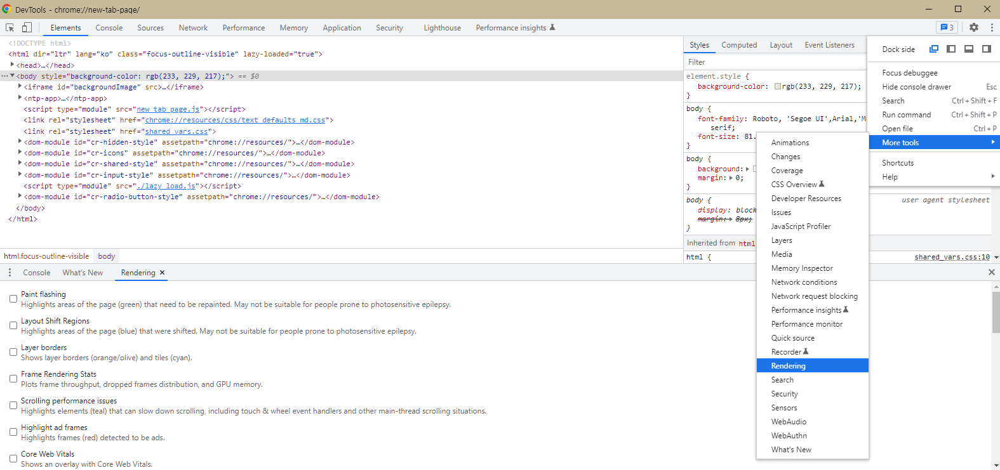
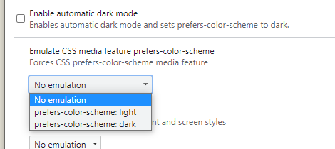

사용자 OS 테마 또는 LocalStorage를 통해 테마를 변경하는 것을 구성하고 이를 조절할 버튼을 구성해보자.

<br/>

# 테마 변경 버튼

## 사전 작업

다음은 저번 Post 때 구성한 Theme이다. 미리 다음과 같이 다크모드를 구성해 두었다.

필요하다면 [Gatsby&React local font 및 ThemeProvider](https://mon823.github.io/post/create-blog-with-gatsby-typescript/Add-local-font/) 글을 확인해보자

```typescript
export const colorLight = {
  bgColor: '#f8f8f8',
  textColor: '#16151b',
  lineColor: '#d2d4d9',
  boxColor: '#f1f3f5',
  commonColor: '#9fa7b1',
  themeColor: '#278f7ac0',
} as const;

export const colorDark = {
  bgColor: '#16151b',
  textColor: '#faffe6',
  lineColor: '#474748',
  boxColor: '#343a40',
  commonColor: '#9fa7b1',
  themeColor: '#278f7ac0',
} as const;

const fontSize = {
  xxl: '36px',
  xl: '24px',
  lg: '20px',
  md: '16px',
  sm: '14px',
  xs: '12px',
} as const;

const fontWeight = {
  thins: '200',
  light: '300',
  regular: '500',
  semiBold: '600',
  bold: 'bold',
} as const;

export type ColorLight = typeof colorLight;
export type Colordark = typeof colorDark;
export type FontSize = typeof fontSize;
export type FontWeight = typeof fontWeight;

export interface Itheme {
  color: ColorLight | Colordark;
  fontSize: FontSize;
  fontWeight: FontWeight;
}

export const theme: Itheme = {
  color: colorLight,
  fontSize: fontSize,
  fontWeight: fontWeight,
};
```

다음으로 다크모드 버튼으로 사용할 Component를 구성해보자

다음은 아무 기능 없는 단순 기능을 구현하였다. CSS는 생략하고 다음과 같이 구성하였다.

```typescript
// import&interface ...생략 (전체 코드는 맨 아래)

const DarkModeIcon = styled.img`
  object-fit: contain;
`;

const DarkMode = () => {
  return (
    <Wrapper>
      <DarkModeBtn>
        <DarkModeIcon src={darkMode} />
      </DarkModeBtn>
    </Wrapper>
  );
};

export { DarkMode };
```

<br/>

## ThemeProvider

테마를 변경하기 위해 ThemeProvider를 새롭게 구성하도록 하자

```typescript
// import&interface ...생략 (전체 코드는 맨 아래)

const ThemeProvider = ({ children }: Ichildren) => {
  return (
    <>
      <StyleProvider theme={theme}>{children}</StyleProvider>
    </>
  );
};
export { ThemeProvider };
```

이제 위 theme 값을 상태에 맞추어 변경하는 로직을 간단하게 구성해보자

필자는 단순히 2개로만 구분하기 위해 Boolean 타입으로 상태 값을 구성하였고 Default는 False 즉 라이트모드이다.

```typescript
// import&interface ...생략 (전체 코드는 맨 아래)

const ThemeProvider = ({ children }: Ichildren) => {
  const [isDarkMode, setDarkMode] = useState<boolean>(false);

  const cloneTheme = structuredClone(theme); // node 17 버전 이상부터 지원

  const isTheme: DefaultTheme = useMemo(() => {
    cloneTheme.color = isDarkMode ? colorDark : colorLight;
    return cloneTheme;
  }, [isDarkMode]);

  return (
    <>
      <StyleProvider theme={isTheme}>{children}</StyleProvider>
    </>
  );
};

export { ThemeProvider };
```

다음과 같이 isDarkMode 상태 값이 바뀌면 isTheme 값을 변경해주는 방식으로 구성하였다.

<br/>

## ContextAPI

React Context API를 통해서 현재 테마 상태 값과 해당 테마를 변경할 수 있는 함수를 내려주도록 하자

```typescript
// import&interface ...생략 (전체 코드는 맨 아래)

const ThemeContextState = {
  isDarkMode: false,
  setDarkMode: () => undefined,
};

const ThemeContext = createContext<IthemeContext>(ThemeContextState);

const ThemeProvider = ({ children }) => {
  const [isDarkMode, setDarkMode] = useState<boolean>(false);

  const cloneTheme = structuredClone(theme); // node 17 버전 이상부터 지원

  const isTheme: DefaultTheme = useMemo(() => {
    cloneTheme.color = isDarkMode ? colorDark : colorLight;
    return cloneTheme;
  }, [isDarkMode]);

  return (
    <>
      <ThemeContext.Provider value={{ isDarkMode, setDarkMode }}>
        <StyleProvider theme={isTheme}>{children}</StyleProvider>
      </ThemeContext.Provider>
    </>
  );
};

export { ThemeProvider };
```

<br/>

## Theme 변경 함수

우선 Theme를 변경할 수 있는 함수를 토글 형식으로 변경하여 export 해주겠다.

```typescript
// import&interface ...생략 (전체 코드는 맨 아래)

// ThemeProvider 생략

const useTheme = () => {
  const { isDarkMode, setDarkMode } = useContext(ThemeContext);
  const toggleTheme = useCallback(() => {
    if (isDarkMode) {
      setDarkMode?.(false);
    } else {
      setDarkMode?.(true);
    }
  }, [isDarkMode]);

  return [isDarkMode, toggleTheme] as const;
};

export { ThemeProvider, useTheme };
```

이제 다시 DarkMode 버튼을 구성한 Component에서 useTheme의 toggleTheme 를 사용하여 테마를 변경하고
최상단 Component에 ThemeProvider를 변경해주도록 하자.

**Layout.tsx**

```typescript
/** Layout.tsx */
// import&interface ...생략 (전체 코드는 맨 아래)

const Layout = ({ children }: Ichildren) => {
  return (
    <>
      <ThemeProvider>
        <GlobalStyle />
        <Components.DarkMode />
        {children}
      </ThemeProvider>
    </>
  );
};

export default Layout;
```

**DarkModeBtn.tsx**

```typescript
/** DarkModeBtn.tsx */
// import&interface ...생략 (전체 코드는 맨 아래)

const DarkModeIcon = styled.img<{ isDark: boolean }>`
  filter: ${props => (props.isDark ? '...생략' : 'none')} /* 예시) props 기반 값 변경 */
  object-fit: contain;
`;

const DarkMode = () => {
  const [isDarkMode, toggleTheme] = useTheme();
  return (
    <Wrapper>
      <DarkModeBtn onClick={toggleTheme}> /* toggleTheme 추가 */
        <DarkModeIcon src={darkMode} isDark={isDarkMode} /> /* styled-components props 추가 */
      </DarkModeBtn>
    </Wrapper>
  );
};

export { DarkMode };
```

<br/>

# LocalStorage

**useTheme**
먼저 localStorage 값을 toggleTheme 함수에 맞추어 변경하도록 하자

상태 값을 True/False 값으로 설정해 준다.

```typescript
// import&interface ...생략 (전체 코드는 맨 아래)

// ThemeProvider 생략

const useTheme = () => {
  const { isDarkMode, setDarkMode } = useContext(ThemeContext);
  const toggleTheme = useCallback(() => {
    if (isDarkMode) {
      setDarkMode?.(false);
      window.localStorage.setItem('theme', 'false');
    } else {
      setDarkMode?.(true);
      window.localStorage.setItem('theme', 'true');
    }
  }, [isDarkMode]);

  return [isDarkMode, toggleTheme] as const;
};

export { ThemeProvider, useTheme };
```

<br/>

**ThemeProvider**

useEffect 내부에서 localStorage 값을 통해 변경

```typescript
// import&interface ...생략 (전체 코드는 맨 아래)

const ThemeProvider = ({ children }) => {
  const [isDarkMode, setDarkMode] = useState<boolean>(false);

  useEffect(() => {
    const localTheme = window.localStorage.getItem('theme'); // string 값
    const isDarkState = localTheme == 'true';

    setDarkMode(isDarkState);
  }, []);

  const cloneTheme = structuredClone(theme); // node 17 버전 이상부터 지원

  const isTheme: DefaultTheme = useMemo(() => {
    cloneTheme.color = isDarkMode ? colorDark : colorLight;
    return cloneTheme;
  }, [isDarkMode]);

  return (
    <>
      <ThemeContext.Provider value={{ isDarkMode, setDarkMode }}>
        <StyleProvider theme={isTheme}>{children}</StyleProvider>
      </ThemeContext.Provider>
    </>
  );
};
```

<br/>

# User OS Theme

**ThemeProvider**

**localStorage 값이 없을 때** os theme가 dark면 다크모드로 표시해주기

```typescript
// import&interface ...생략 (전체 코드는 맨 아래)

const ThemeProvider = ({ children }) => {
  const [isDarkMode, setDarkMode] = useState<boolean>(false);

  useEffect(() => {
    const localTheme = window.localStorage.getItem('theme'); // string 값
    const systemPrefers = window.matchMedia('(prefers-color-scheme: dark)').matches;
    const osTheme = systemPrefers ? true : false;
    const isDarkState = localTheme == null ? osTheme : checkStringTrue(localTheme);

    setDarkMode(isDarkState);
  });

  const cloneTheme = structuredClone(theme); // node 17 버전 이상부터 지원

  const isTheme: DefaultTheme = useMemo(() => {
    cloneTheme.color = isDarkMode ? colorDark : colorLight;
    return cloneTheme;
  }, [isDarkMode]);

  return (
    <>
      <ThemeContext.Provider value={{ isDarkMode, setDarkMode }}>
        <StyleProvider theme={isTheme}>{children}</StyleProvider>
      </ThemeContext.Provider>
    </>
  );
};
```

<br/>

# Gatsby 에서 깜빡임

아마도 위와 같이 구성하면 초깃값은 무조건 False 값 즉 라이트모드라서 라이트 모드가 되었다가 다크모드로 전환되는 깜빡임 현상이 생길 수 있다.

여러 해결 방법이 있지만 그중 하나를 소개한다

```typescript
// import&interface ...생략 (전체 코드는 맨 아래)

const ThemeProvider = ({ children }) => {
  const [isDarkMode, setDarkMode] = useState<boolean>(false);
  const [isLoad, setLoad] = useState(true);

  useEffect(() => {
    const localTheme = window.localStorage.getItem('theme');
    const systemPrefers = window.matchMedia('(prefers-color-scheme: dark)').matches;
    const osTheme = systemPrefers ? true : false;
    const isDarkState = localTheme == null ? osTheme : checkStringTrue(localTheme);

    setDarkMode(isDarkState);
    setLoad(false);
  });

  const cloneTheme = structuredClone(theme); // node 17 버전 이상부터 지원

  const isTheme: DefaultTheme = useMemo(() => {
    cloneTheme.color = isDarkMode ? colorDark : colorLight;
    return cloneTheme;
  }, [isDarkMode]);

  return isLoad ? (
    <></>
  ) : (
    <>
      <ThemeContext.Provider value={{ isDarkMode, setDarkMode }}>
        <StyleProvider theme={isTheme}>{children}</StyleProvider>
      </ThemeContext.Provider>
    </>
  );
};
```

다음과 같이 진행하면 우리가 원하는 값이 결정되기 전까지 어떠한 값도 들어가지 않기 때문에 깜박임 현상을 해결할 수 있다.

<br/>

# 최종 코드

```typescript
import React, { useState, createContext, useContext, ReactNode, useCallback, useMemo, useEffect } from 'react';
import { DefaultTheme, ThemeProvider as StyleProvider } from 'styled-components';
import { theme, colorLight, colorDark } from '@styles/theme';
import { checkStringTrue } from '@/utils/stringTypeToBool';

interface Ichildren {
  children: ReactNode;
}
interface IthemeContext {
  isDarkMode: boolean;
  setDarkMode: React.Dispatch<React.SetStateAction<boolean>> | undefined;
}

const ThemeContextState = {
  isDarkMode: false,
  setDarkMode: () => undefined,
};

const ThemeContext = createContext<IthemeContext>(ThemeContextState);

const ThemeProvider = ({ children }: Ichildren) => {
  const [isDarkMode, setDarkMode] = useState<boolean>(false);
  const [isLoad, setLoad] = useState(true);

  useEffect(() => {
    const localTheme = window.localStorage.getItem('theme');
    const systemPrefers = window.matchMedia('(prefers-color-scheme: dark)').matches;
    const osTheme = systemPrefers ? true : false;
    const isDarkState = localTheme == null ? osTheme : checkStringTrue(localTheme);

    setDarkMode(isDarkState);
    setLoad(false);
  }, []);

  const cloneTheme = structuredClone(theme);
  const isTheme: DefaultTheme = useMemo(() => {
    cloneTheme.color = isDarkMode ? colorDark : colorLight;

    return cloneTheme;
  }, [isDarkMode]);

  return isLoad ? (
    <></>
  ) : (
    <>
      <ThemeContext.Provider value={{ isDarkMode, setDarkMode }}>
        <StyleProvider theme={isTheme}>{children}</StyleProvider>
      </ThemeContext.Provider>
    </>
  );
};

const useTheme = () => {
  const { isDarkMode, setDarkMode } = useContext(ThemeContext);
  const toggleTheme = useCallback(() => {
    if (isDarkMode) {
      setDarkMode?.(false);
      window.localStorage.setItem('theme', 'false');
    } else {
      setDarkMode?.(true);
      window.localStorage.setItem('theme', 'true');
    }
  }, [isDarkMode]);

  return [isDarkMode, toggleTheme] as const;
};

export { ThemeProvider, useTheme };
```

<br/>

# 추가 팁

다음과 같이



개발자 도구에서 위와 같은 위치로 들어가면



다음과 같은 설정이 있는데 이걸 변경하면 dark & light 모드 변경이 가능합니다.

p.s. 위 코드에서는 localStorage가 없어야만 os theme값을 읽기 때문에 지우고 하셔야 해요.
