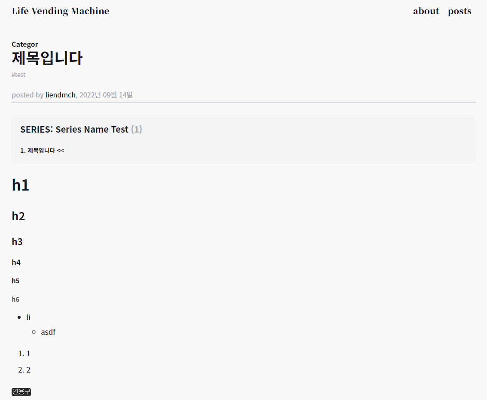

블로그 글을 어떻게 작성하는지 알아보고 또 어떻게 생성되는지 구성해보지

평소 문서를 Markdown으로 하는 것을 좋아했고 또  익숙하기 때문에 블로그 글을 Markdown으로 작성하고 이를 원하는 템플릿에 작성되게 할 생각이다.

<br/>

# Gatsby Plugin

## source-filesystem

Gatsby Plugin의 도움을 받아서 로컬 파일 시스템의 파일을 Node로 생성해준다.

먼저 설치부터 하고

```bash
$ npm install gatsby-source-filesystem
```

gatsby-config.ts에서 plugin 추가하기

```typescript
  plugins: [
    {
      resolve: 'gatsby-source-filesystem',
      options: {
        name: 'markdown-pages',
        path: `${__dirname}/src/markdown-pages`,
      },
    },
  ],
```

path 위치는 이제 markdown-page를 모아둘 dir를 위치로 한다.


<br/>

## transformer remark

Gatsby의 Plugin의 도움을 받아서 작성된 markdown을 파싱하여 MarkdownRemark Node로 만든다.

마크다운 프로세서로는 Remark가 사용된다.

먼저 설치해 보자

```bash
$ npm install gatsby-transformer-remark
```

그리고 다음으로 gatsby-config.ts에서 plugin 추가를 해주자

```typescript
plugins: [
  {
    resolve: `gatsby-transformer-remark`,
    options: {
    },
  },
],
```

이제 GraphQL을 통해 정보를 얻을 수 있다.

이제 사용 준비는 끝났다.


<br/>

## GraphQL

이제 GraphQL에서 MarkdownRemark Node를 통해 값을 가져온다.

먼저 Markdown을 작성해보자

우선 기본적인 정보를 다음과 같이 7가지를 구성하였다. 파일에 대한 정보는 개인이 필요로 하는 부분으로 채워서 사용하면 된다.

그리고 그 아래로는 Markdown을 작성해준다.

```markdown
---
date: '2022-09-14T15:12:08'
stage: PUBLISHED
series: Series Name Test
category: Category
slug: series-name-test/test/
title: 제목입니다
tag: test
---

# h1

## h2

### h3

#### h4

##### h5

###### h6

- li
  - asdf

1. 1
2. 2

`인용구`

```

이제 GraphQL에 값이 잘 들어갔는지 확인해보자

먼저 실행부터 한 후

```bash
$ npm run develop
```

localhost:8000___graphql에서 Graphql 쿼리를 통해 값이 잘 들어갔는지 확인해보자

```json
{
  allMarkdownRemark(
    filter: {frontmatter: {stage: {eq: "PUBLISHED"}}}
    sort: {order: ASC, fields: [frontmatter___date]}
  ) {
    edges {
      node {
        frontmatter {
          title
          date
          slug
          series
          category
          tag
        }
        excerpt(pruneLength: 500, truncate: true)
      }
      next {
        frontmatter {
          slug
          title
        }
        excerpt
      }
      previous {
        frontmatter {
          slug
          title
        }
        excerpt(pruneLength: 200, truncate: true)
      }
    }
  }
}
```

다음과 같이 필요한 정보들을 Query 해서 실행해보면

다음과 같이 정보를 얻을 수 있다.

```json
{
  "data": {
    "allMarkdownRemark": {
      "edges": [
        {
          "node": {
            "frontmatter": {
              "title": "제목입니다",
              "date": "2022-09-14T15:12:08",
              "slug": "series-name-test/test/",
              "series": "Series Name Test",
              "category": "Category",
              "tag": "test"
            },
            "excerpt": "h1 h2 h3 h4 h5 h6 li asdf 1 2"
          },
          "next": null,
          "previous": null
        }
      ]
    }
  },
  "extensions": {}
}
```

이제 Query가 잘 되는 것을 알았으니 이 정보들을 통해 페이지를 구성해보자


<br/>

# CreatePage

## Template
먼저 페이지에 들어갈 Template를 구성해보자

```typescript
import React from 'react';
import Layout from '@/layouts/MainLayout';
import { graphql } from 'gatsby';
import * as Components from '@/components';

import type { IpostData } from '@/types/dataType';

const Template = (props: IpostData) => {
  return (
    //... 생략
  );
};

export const pageQuery = graphql`
  query ($slug: String!) {
    markdownRemark(frontmatter: { slug: { eq: $slug } }) {
      html
      tableOfContents(maxDepth: 3)
      frontmatter {
        date(formatString: "YYYY년 MM월 DD일 ")
        title
        slug
        series
        category
        tag
      }
      excerpt(truncate: true, pruneLength: 100)
    }
    site {
      siteMetadata {
        comments {
          utterances {
            repo
          }
        }
      }
    }
  }
`;

export default Template;

```

위와 같이 template를 구성하자 생략된 부분에서 위 데이터를 이용한다.

여기서 필요한 데이터 타입은 다음과 같이 구성했다. 

```typescript
export interface IpostData {
  data: {
    markdownRemark: {
      frontmatter: {
        title: string;
        slug: string;
        series: string | null;
        tag: string | null;
        category: string;
        date: string;
      };
      html: string;
      tableOfContents: string;
      excerpt: string;
    };
    site: {
      siteMetadata: {
        comments: {
          utterances: {
            repo: string;
          };
        };
      };
    };
  };
  pageContext: {
    next?: {
      frontmatter: {
        title: string;
        slug: string;
      };
      excerpt: string;
    };
    previous?: {
      frontmatter: {
        title: string;
        slug: string;
      };
      excerpt: string;
    };
  };
}

```


<br/>

## gatsby-node.ts

이제 root 폴더 내부에 gatsby-node.ts를 생성하자

```typescript
import type { GatsbyNode, Actions } from 'gatsby';
import path from 'path';

export const createPages: GatsbyNode['createPages'] = async ({ actions, graphql }) => {
  const result: IallMarkdownData = await graphql(`
    {
      allMarkdownRemark(filter: { frontmatter: { stage: { eq: "PUBLISHED" } } }, sort: { order: ASC, fields: [frontmatter___date] }) {
        edges {
          node {
            frontmatter {
              title
              date
              slug
              series
              category
              tag
            }
            excerpt(pruneLength: 500, truncate: true)
          }
          next {
            frontmatter {
              slug
              title
            }
            excerpt
          }
          previous {
            frontmatter {
              slug
              title
            }
            excerpt(pruneLength: 200, truncate: true)
          }
        }
      }
    }
  `);
  const { createPage } = actions;
  const blogPostTemplate = path.resolve('src/layouts/BlogPostTemplate.tsx');
  if (result.data) {
    result.data.allMarkdownRemark.edges.forEach(({ node, next, previous }) => {
      createPage({
        path: `/post/${node.frontmatter.slug}`,
        component: blogPostTemplate,
        context: {
          title: node.frontmatter.title,
          date: node.frontmatter.date,
          slug: node.frontmatter.slug,
          series: node.frontmatter.series,
          category: node.frontmatter.category,
          tag: node.frontmatter.tag,
          next: next,
          previous: previous,
        },
      });
    });
  }
```

다음과 같이 createPages에서 graphql을 통해 값을 쿼리하고 해당 값을 통해서 Page를 생성해준다.

이제 createPage에서 `path:` 작성한 path로 들어가 보자.

위 Markdown에 대한 페이지는 다음과 같다.



다음과 같은 방법으로 다양하게 원하는 페이지를 구성할 수 있다.

**p.s.** 제 블로그에서 Main Home을 제외한 모든 페이지는 createPage를 통해서 만들어졌다.