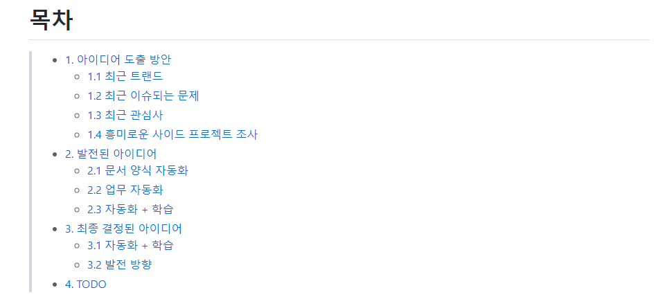
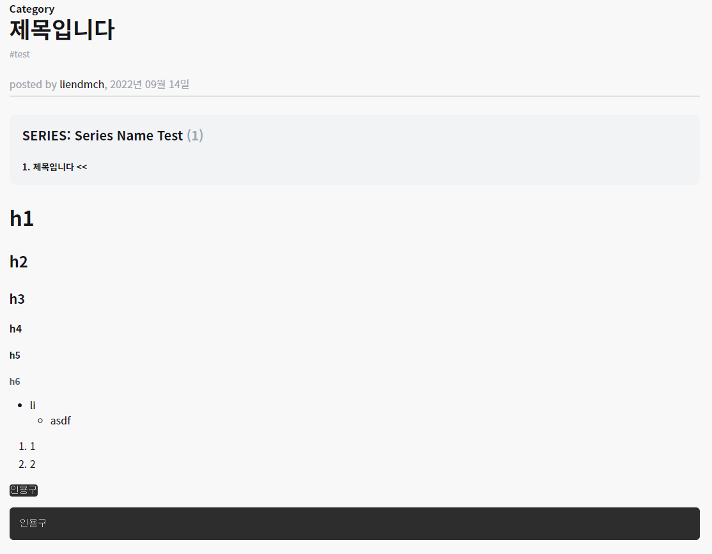
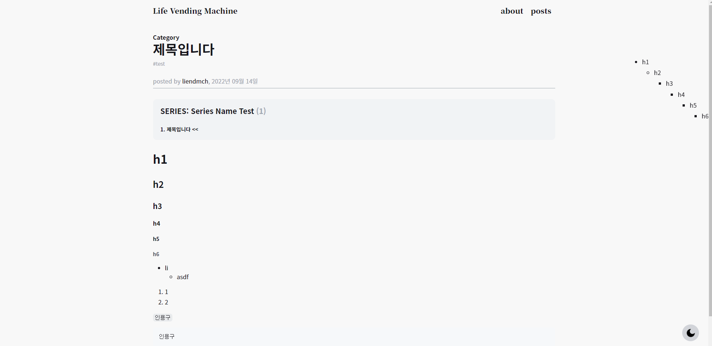
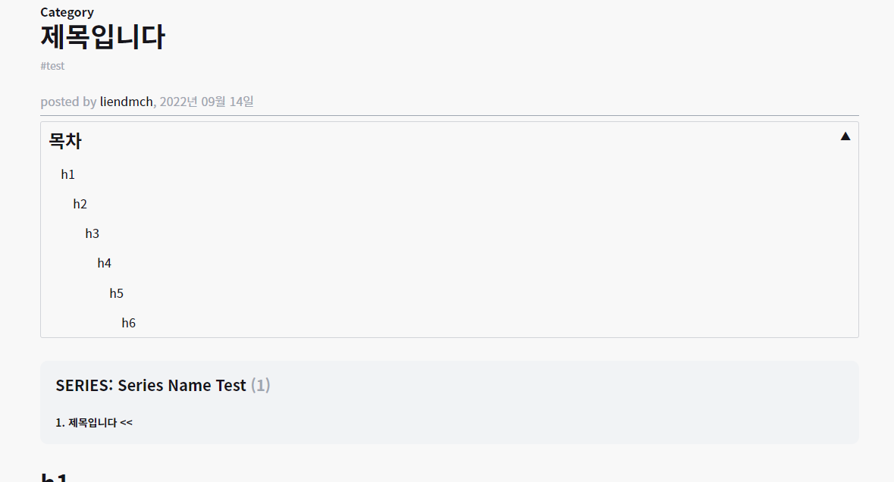
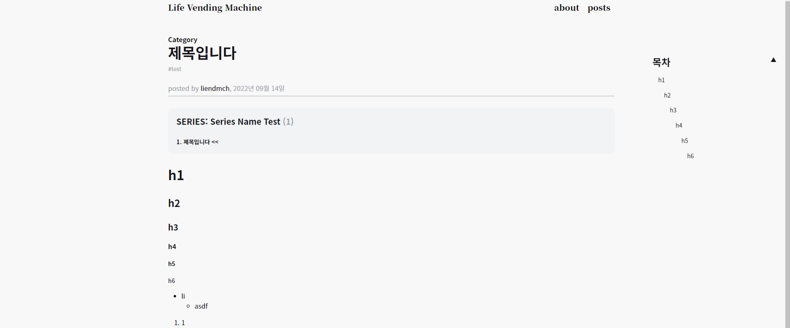

오늘은 저번 시간에 이어서 Markdown **TOC** (Table Of Content)를 구성하려고 한다.

사실 Gatsby 플러그인이 각 문서에 맞는 TOC를 생성해준다.

나는 이 TOC를 원하는 상황과 위치에 맞게 변경하고자 한다.



이전에 프로젝트를 진행하면서 Wiki 문서 상단에 다음과 같이 TOC를 적어두곤 했다.

Wiki 문서의 한계로 인해 원하는 부분에 배치하기 좀 어렵기도 했고 사실 Markdown 문서의 한계일지도 모른다.

그래서 이번 블로그를 구상하면서 다음과 같은 기능을 가지고자 했다

**1. 빈공간 사이드에 배치가 가능**

**2. 사용자의 해상도에 맞게 Main context로 포함시키기**

**3. TOC를 접고 펼치기 가능하게 하기**

**4. 첫 로드시 해상도 크기가 기준치 이상이면 사이드에 펼쳐서 보여주기**

**5. 첫 로시 해상도 크기가 기준치 이하면 Main context에 접어서 보여주기**

# gatsby plugin

[gatsby-remark-autolink-headers 공식 docs](https://www.gatsbyjs.com/plugins/gatsby-remark-autolink-headers/)를 보고 진행해도 설치는 충분하다.

```bash
npm install -save gatsby-remark-autolink-headers
```

**⚠ 주의**
`gatsby-remark-prismjs`를 사용중이면 다음과 같이 꼭 autolink-headers 를 더 위에 작성하는 것을 권장하고 있다.

```json
{
  "resolve": `gatsby-transformer-remark`,
  "options": {
    "plugins": [`gatsby-remark-autolink-headers`, `gatsby-remark-prismjs`]
  }
}
```

## 적용 확인하기



먼저 다음과 같은 테스트 페이지를 구성하였다.

위 페이지를 구성하기 위해서 다음과 같은 query 데이터를 가져왔다. 여기서 TOC로 사용될 데이터는 tableOfContents 지만 이상태로 TOC를 구성해도 해당 위치로 이동시켜주지 않는다.

차이는 html 에 있다.

Graphql을 통해 해당 문서를 쿼리한 결과 중 html 결과만 가지고 왔다.

**plugin 설치 이전**

```json
"html": "<h1>h1</h1>\n"
```

**plugin 설치 이후**

```json
"html": "<h1 id=\"h1\" style=\"position:relative;\"><a href=\"#h1\" aria-label=\"h1 permalink\" class=\"anchor before\"><svg aria-hidden=\"true\" focusable=\"false\" height=\"16\" version=\"1.1\" viewBox=\"0 0 16 16\" width=\"16\"><path fill-rule=\"evenodd\" d=\"M4 9h1v1H4c-1.5 0-3-1.69-3-3.5S2.55 3 4 3h4c1.45 0 3 1.69 3 3.5 0 1.41-.91 2.72-2 3.25V8.59c.58-.45 1-1.27 1-2.09C10 5.22 8.98 4 8 4H4c-.98 0-2 1.22-2 2.5S3 9 4 9zm9-3h-1v1h1c1 0 2 1.22 2 2.5S13.98 12 13 12H9c-.98 0-2-1.22-2-2.5 0-.83.42-1.64 1-2.09V6.25c-1.09.53-2 1.84-2 3.25C6 11.31 7.55 13 9 13h4c1.45 0 3-1.69 3-3.5S14.5 6 13 6z\"></path></svg></a>h1</h1>\n"
```

자세한 사항은 직접 적용해서 보도록 하자..

이제 기존 tableOfContents 를 활용해 TOC 를 구성해보도록 하자

# TOC 구성하기

우선 사이드 공간에 TOC를 배치하기 위해서 컴포넌트를 먼저 생성해주자

```typescript
import React from 'react';
import styled from 'styled-components';

interface Iprops {
  html: string;
}

export const PostToc = ({ html }: Iprops) => {
  return (
    <>
      <div className="markdown-toc" dangerouslySetInnerHTML={{ __html: html }} />
    </>
  );
};
```

우선 TOC에 필요한 HTML은 주기때문에 html 을 Props 로 받아주고 다음과 같이 바로 띄워주면 원하는 TOC는 보이게 된다.

## 빈공간 사이드 배치하기

이제 오른쪽 빈공간 사이드에 배치하기 위해 `position: fixed`를 통해 오른쪽으로 옮겨 주었다.

```typescript
import React from 'react';
import styled from 'styled-components';

const Wrapper = styled.div`
  position: fixed;
  z-index: 1000;
  top: 150px;
  right: 0px;
  width: 300px;
  margin-right: 20px;
`;

interface Iprops {
  html: string;
}

export const PostToc = ({ html }: Iprops) => {
  return (
    <Wrapper>
      <div className="markdown-toc" dangerouslySetInnerHTML={{ __html: html }} />
    </Wrapper>
  );
};
```

다음과 같이 오른쪽 사이드에 배치 하였다.



### 간단하게 css 작업 해주기

markdownToc.css

```css
.markdown-toc a {
  background-color: transparent;
  text-decoration: none;
}

.markdown-toc a:link {
  text-decoration: none;
}
.markdown-toc a:active,
.markdown-toc a:hover {
  outline-width: 0;
}
.markdown-toc a:hover {
  text-decoration: underline;
}
.markdown-toc ul {
  list-style: none;
  padding-left: 1em;
}

.markdown-toc li {
  margin: 20px 0px 0px 0px;
  overflow: hidden;
  white-space: nowrap;
  text-overflow: ellipsis;
}

.markdown-toc p {
  overflow: hidden;
  white-space: nowrap;
  text-overflow: ellipsis;
}
```

간단하게

**1. 마진값 변경**

**2. text-overflow 처리**

**3. list-style 제거**

**4. hover시 text-decoration: underline 구성**

## 사용자의 해상도에 맞게 Main context로 포함시키기

해상도에 맞게 변경 해주기 위해 `@media` 쿼리를 사용하여 구성한다

```typescript
const Wrapper = styled.div`
  position: fixed;
  z-index: 1000;
  top: 150px;
  right: 0px;
  width: 300px;
  margin-right: 20px;
  font-size: ${({ theme }) => theme.fontSize.sm};

  @media screen and (max-width: 1720px) {
    width: 200px;
  }
  @media screen and (max-width: 1520px) {
    position: relative;
    border-radius: 3px;
    width: 100%;
    top: 0px;
    padding: 10px;
    margin-bottom: 20px;
    font-size: ${({ theme }) => theme.fontSize.md};
    border: 1px solid ${({ theme }) => theme.color.lineColor};
  }
`;
```

1720px 이하에서는 width 값을 줄여주고

1520px 이하에서는 postion을 변경하여 Main context에 포함되게 한다.

**1520px 이하에서 실행된 모습**



**1520px 이상에서 실행된 모습**



## 접고 펼치기

접고 펼치기를 위해 다음과 같이 기본적인 요소를 추가하였다

```typescript
export const PostToc = ({ html }: Iprops) => {
  return (
    <Wrapper>
      <HeaderWrapper onClick={tocSwitch}>
        <Word>목차</Word>
        <Btn className="toc-btn">▼</Btn>
      </HeaderWrapper>
      <div className="markdown-toc" dangerouslySetInnerHTML={{ __html: html }} />
    </Wrapper>
  );
};
```

이제 `tocSwitch` 를 구성하여 HeaderWrapper를 클릭할 경우 펼치거나 접어지게 구성하자

```typescript
const tocSwitch = () => {
  const el = document.querySelector<HTMLElement>('.markdown-toc');
  const elBtn = document.querySelector<HTMLElement>('.toc-btn');
  if (el && elBtn) {
    if (el.style.display == '') el.style.display = 'block';
    if (el.style.display == 'none') {
      el.style.display = 'block';
      elBtn.innerText = '▲';
    } else {
      el.style.display = 'none';
      elBtn.innerText = '▼';
    }
  }
};
```

markdown-toc는 css로 따로 처리를 해주었기 때문에 직접 querySelector를 이용하여 값을 변환하게 하였다.

단순하게 클릭하면 안보이게 또는 보이게 토글해주는 로직이다.

## 해상도에 맞추어 펼치거나 접기

우선 모바일 환경을 고려하여 구성한 Page인 만큼 가로 해상도에 따른 TOC 위치가 변화한다.

문제는 TOC 가 Main으로 올 경우 첫 글이 너무 아래로 내려가기 때문에

처음 해상도 로드시 1520px **이하**시 접어서 1520px **이상**일 경우 펼쳐서 보여줄 생각이다.

사실 처음에 너무 복잡하게 생각했는데 그냥

```typescript
  @media screen and (max-width: 1520px) {
   .markdown-toc {
      display: none;
    }
  }
```

이거 한줄 추가해서 완성하였다.

GIF가 아닌 이상에야 동작하는 것을 보여주기 힘들지만 필자가 작성중인 지금 상태에서는 이 글이 위 코드에 결과라 할 수 있다.

사실 아무도 몰랐을거 같다. 그정도로 그다지 중요한건 아니지만 내가 원하는 TOC 를 구성하였다.

디자인은 나 못하겠어 🙂
