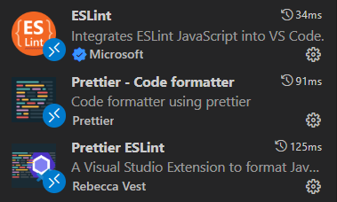

저번에는 Gatsby 프로젝트를 생성하고 실행까지 해보았다. 이번에는 Alias 설정과 Lint 설정을 하고 Styled components 설정까지 마무리 할것이다.

<br/>

# Alias 설정

다음과 같은 구조를 alias 해주도록 하자. 구성을 완료하고 나면 폴더 위치를

`@components` 와 같이 접근 할 수 있다.

```bash
D:.
|
+---src
|   |
|   +---components
|   |
|   +---hooks
|   |
|   +---images
|   |
|   +---layouts
|   |
|   +---markdown-pages
|   |
|   +---pages
|   |
|   +---styles
|   |
|   +---types
|   |
|   \---utils
|
\---static
```

우선 Gatsby 를 사용하는 만큼 Gatsby Plugin 을 다운받고 시작하도록 하자

```bash
$ npm install gatsby-plugin-alias-imports
```

gatsby-config.ts 와 tsconfig.json 에서 다음과 같이 설정을 진행하자

```typescript
/**
 * gatsby-config.ts
 **/

import type { GatsbyConfig } from 'gatsby';

const config: GatsbyConfig = {
  siteMetadata: {
    title: `life vending machine`,
    siteUrl: `https://www.yourdomain.tld`,
  },
  // More easily incorporate content into your pages through automatic TypeScript type generation and better GraphQL IntelliSense.
  // If you use VSCode you can also use the GraphQL plugin
  // Learn more at: https://gatsby.dev/graphql-typegen
  graphqlTypegen: true,
  plugins: [
    // 여기에 추가
    {
      resolve: 'gatsby-plugin-alias-imports',
      options: {
        alias: {
          '@': 'src',
          '@components': 'src/components',
          '@styles': 'src/styles',
          '@utils': 'src/utils',
          '@layouts': 'src/layouts',
          '@pages': 'src/pages',
          '@hooks': 'src/hooks',
          '@images': 'src/images',
          '@types': 'src/types',
        },
      },
    },
  ],
};

export default config;
```

<br/>

```json
/* tsconfig.json */

{
  "compilerOptions": {
    "module": "esnext",
    "moduleResolution": "node",
    "baseUrl": "./",
    "esModuleInterop": true,

    "strict": true,

    "skipLibCheck": true,
    "paths": {
      // 여기에 추가
      "@/*": ["src/*"],
      "@components/*": ["src/components/*"],
      "@styles/*": ["src/styles/*"],
      "@utils/*": ["src/utils/*"],
      "@layouts/*": ["src/layouts/*"],
      "@pages/*": ["src/pages/*"],
      "@images/*": ["src/images/*"],
      "@hooks/*": ["src/hooks/*"],
      "@types/*": ["src/types/*"]
    }
  },
  "include": ["./src/**/*", "./gatsby-node.ts", "gatsby-ssr.tsx", "gatsby-browser.tsx", "./gatsby-config.ts", "./meta-config.ts", "./plugins/**/*"]
}
```

<br/>

# eslint & prettier

먼저 Eslint 는 자바스크립트 문법에서 **에러를 표시해주는 도구**이며 세부적인 코딩스타일까지 설정 할 수 있다.

다음으로 Prettier 는 모든 코드가 **일관된 스타일을 준수**하도록 만들어주는 도구이다.

따라서 Lint와 Prettier를 사용하여 문법적 오류를 잡고 코드 스타일을 일관성있게 관리하도록 할 예정이다.

먼저 **VSCode Extention**와 **npm** 둘다 설치하는 것을 권장한다.

<br/>

## VScode Extention 설치

먼저 VSCode Extention 은 다음과 같다



전부 받아주면 된다.

안되는 경우에는 아래 설정을 변경해보도록 하자

설정(ctrl + ,) 에서 formatter 검색 후 Editor:Default Formatter 변경하기

<br/>

## NPM install

dependencies 설치

```bash
$ npm install eslint prettier eslint-plugin-prettier eslint-config-prettier @typescript-eslint/eslint-plugin @typescript-eslint/parser
```

<br/>

## eslintrc & prettierrc 구성

- .eslintrc.json

```json
/* .eslintrc.json */
{
  "env": {
    "browser": true,
    "es2021": true
  },
  "extends": [
    "eslint:recommended",
    "plugin:@typescript-eslint/eslint-recommended",
    "plugin:@typescript-eslint/recommended",
    "plugin:@typescript-eslint/recommended-requiring-type-checking",
    "plugin:prettier/recommended"
  ],
  "parser": "@typescript-eslint/parser",
  "parserOptions": {
    "ecmaFeatures": {
      "jsx": true
    },
    "ecmaVersion": 12,
    "sourceType": "module",
    "project": "./tsconfig.json"
  },
  "plugins": ["react", "@typescript-eslint"],
  "ignorePatterns": ["pulbic/", "node_modules/"],
  "rules": {
    "prettier/prettier": ["error", { "endOfLine": "auto" }]
  },
  "settings": {
    "import/parsers": {
      "@typescript-eslint/parser": [".ts", ".tsx", ".js"]
    },
    "import/resolver": {
      "typescript": "./tsconfig.json"
    }
  }
}
```

- .prettierrc

```json
/* .prettierrc */
{
  "printWidth": 160,
  "tabWidth": 2,
  "useTabs": false,
  "semi": true,
  "singleQuote": true,
  "quoteProps": "as-needed",
  "trailingComma": "all",
  "bracketSpacing": true,
  "arrowParens": "avoid",
  "endOfLine": "lf"
}
```

세부적인 사항은 같이 작업하는 팀에서 설정하는 것이고 개인이라면 개인의 환경에 맞게 진행하기 때문에 세부 사항은 잘 조율하도록 하자

<br/>

# Styled-components

<br/>

## 설치

시리즈 서론에서 말했듯 나는 Styled Components를 사용할 예정이기에 간단하게 설치만 해주려고 한다.

```bash
$ npm install styled-components @types/styled-components gatsby-plugin-styled-components
```

<br/>

## style reset

그리고 간단하게 style을 reset 하려고 하는데 2가지 방법이 있다.

<br/>

### 1. styled-reset 다운받기

```bash
$ npm install styled-reset
```

다음과 같이 reset css 적용후 원하는 부분 수정하기

```typescript
import { createGlobalStyle } from 'styled-components';
import reset from 'styled-reset';

export const GlobalStyle = createGlobalStyle`
  ${reset}
  body {
    font-family: 'SourceHanSans';
    background-color: ${({ theme }) => theme.color.bgColor};
    color : ${({ theme }) => theme.color.textColor};
    width: 100%;
    height: 100%;
  }
  .utterances {
    max-width: 100% !important;
  }
`;
```

<br/>

### 2. 직접 reset css 작성하기

```typescript
import { css, createGlobalStyle } from 'styled-components';

export const resetCss = css`
  /* prettier-ignore */
  html, body, div, span, applet, object, iframe,
  h1, h2, h3, h4, h5, h6, p, blockquote, pre,
  a, abbr, acronym, address, big, cite, code,
  del, dfn, em, img, ins, kbd, q, s, samp,
  small, strike, strong, sub, sup, tt, var,
  b, u, i, center,
  dl, dt, dd, ol, ul, li,
  fieldset, form, label, legend,
  table, caption, tbody, tfoot, thead, tr, th, td,
  article, aside, canvas, details, embed, 
  figure, figcaption, footer, header, hgroup, 
  menu, nav, output, ruby, section, summary,
  time, mark, audio, video {
    margin: 0;
    padding: 0;
    border: 0;
    font-size: 100%;
    vertical-align: baseline;
    box-sizing: border-box;
  }
  html,
  #app {
    width: 100%;
    height: 100%;
  }
  body {
    width: 100%;
    height: 100%;
    font-size: 100%;
    font-weight: 500;
    line-height: 1.2;
    font-family: 'SourceHanSerif', 'SourceHanSans', -apple-system, BlinkMacSystemFont, 'Helvetica Neue', 'Apple SD Gothic Neo', 'Malgun Gothic', '맑은 고딕', 나눔고딕,
      'Nanum Gothic', 'Noto Sans KR', 'Noto Sans CJK KR', arial, 돋움, Dotum, Tahoma, Geneva, sans-serif;
    -webkit-font-smoothing: antialiased;
    -moz-osx-font-smoothing: grayscale;
    box-sizing: border-box;
  }
  * {
    box-sizing: inherit;
  }
  input,
  button,
  textarea {
    font-family: inherit;
  }
  /* prettier-ignore */
  article, aside, details, figcaption, figure, 
  footer, header, hgroup, menu, nav, section {
    display: block;
  }
  blockquote,
  q {
    quotes: none;
  }
  /* prettier-ignore */
  blockquote:before, blockquote:after,
  q:before, q:after {
    content: '';
    content: none;
  }
  table {
    border-collapse: collapse;
    border-spacing: 0;
  }
  a {
    text-decoration: none;
    color: inherit;
  }
  a:link {
    text-decoration: none;
  }
  a:visited {
    text-decoration: none;
  }
  a:hover {
    text-decoration: none;
  }
  input {
    outline: 0;
    font-weight: 500;
  }
  button {
    outline: 0;
    cursor: pointer;
    font-weight: 500;
  }
`;

export const GlobalStyle = createGlobalStyle`
  ${resetCss}
  body {
    width: 100%;
    height: 100%;
  }
`;
```

<br/>

# P.S

아직 개발 시작도 못함...
