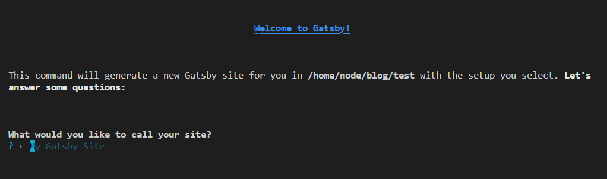
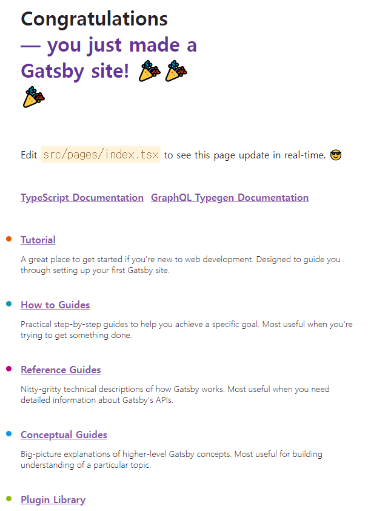
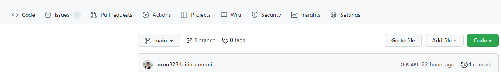
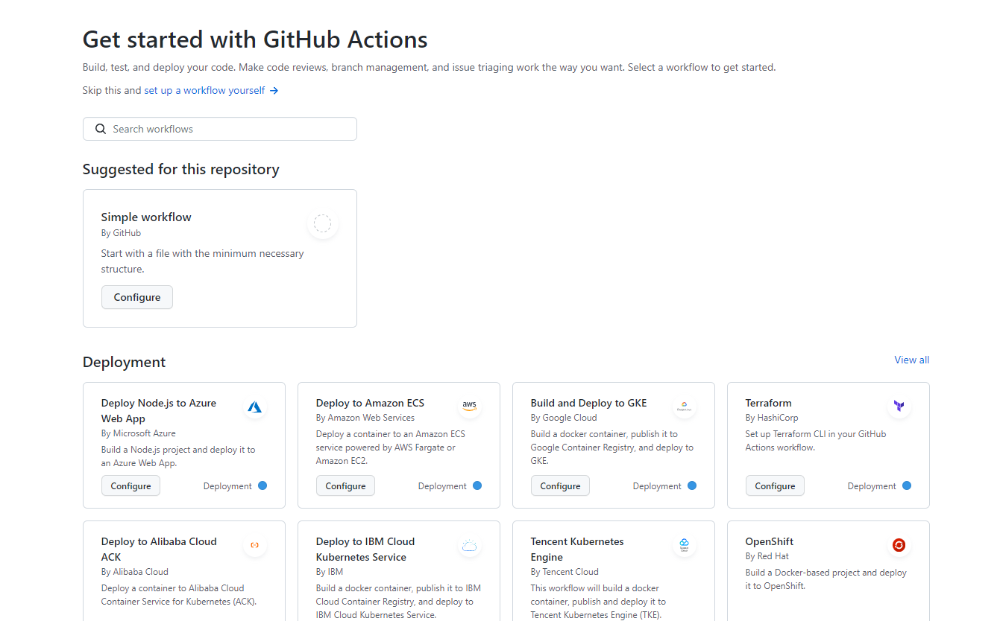
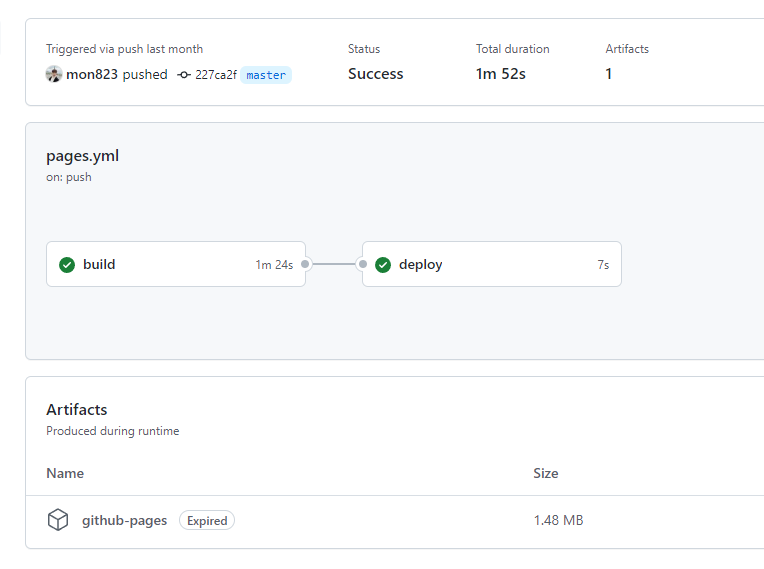

우선 간단하게 Gatsby 프로젝트 생성하고 Github.io에 바로 띄우는 것 까지 합니다.

Git npm 등는 기본적으로 설치되어 있다는 가정하에 시작합니다.

<br/>

## Gatsby 설치

먼저 **gatsby-cli** 부터 설치해야합니다.

```bash
$ npm install -g gatsby-cli
```

<br/>

## 1. 프로젝트 생성

```bash
$ gatsby new
```

실행하면 다음과 같이 선택지가 시작됩니다.



여러 질문들을 통해 구성을 해줍니다 개인에 상황에 맞추어서 진행하면 됩니다.

**중요한건 앞으로 Typescript 로 작성할 예정이기에 Typescript 하실분은 꼭꼭 선택하세요**

저는 이름 외에 Typescript를 선택하였고 나머지는 선택하지 않았습니다.

<br/>

## 2. 실행

```bash
$ npm run develop
```

다음 명령어로 실행되는 것을 확인해 봅시다.

안되면 명령어 실행 경로가 맞는지 확인해보세요!

실행 화면



<br/>

## 3. Deploy 구성하기

⚠ Git에 대한 설명은 없습니다. 이해가 안되시면 넘어가셔도 좋습니다. 나중에 Deply 하면 되니까요!

개발에 앞서서 우선 Deploy를 먼저 구성했습니다.

Github Action을 통해 진행하면 빠르고 편하고 좋습니다.

먼저 자신의 repo 로 가볼게요.



여기서 Actions에 가셔서 새로 등록하면 됩니다.

안뜨시면 repo 설정가셔서 확인해보세요.



다음과 같은 화면에서 **Gatsby** 검색하시면 Gatsby가 뜨고 Configure을 눌러서 보시면 다음과 같은 Editor 나 나오는데 나머지는 직접 보시고

상단에 branches 부분만 자신이 적용하고 싶은 브런치로 하시면 자동으로 빌드 해줍니다.

추가로 node-version 등등 중요하신 분들은 수정해주세요.

```yml
# Sample workflow for building and deploying a Gatsby site to GitHub Pages
#
# To get started with Gatsby see: https://www.gatsbyjs.com/docs/quick-start/
#
name: Deploy Gatsby site to Pages

on:
  # Runs on pushes targeting the default branch
  push:
    branches: ['master'] ## 여기 이부분

#... 생략
```

<br/>

## 4. Deploy 결과

이제 해당 브런치에 PUSH 하면 다음과 같이 Deply가 됩니다.~

아래사진은 첫 push 기록인거 같아요



<br/>

## P.S

아직 갈길이 멀다...
