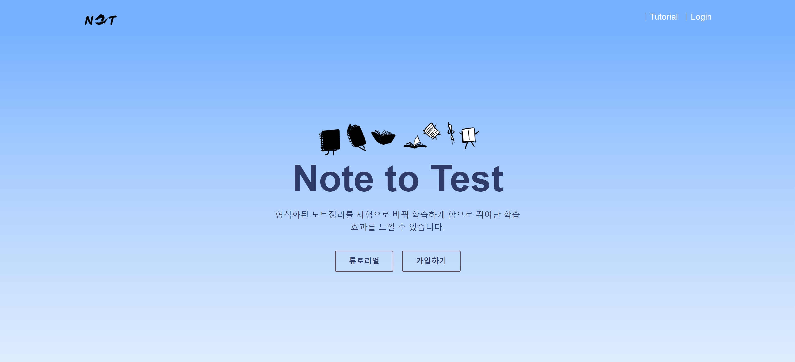
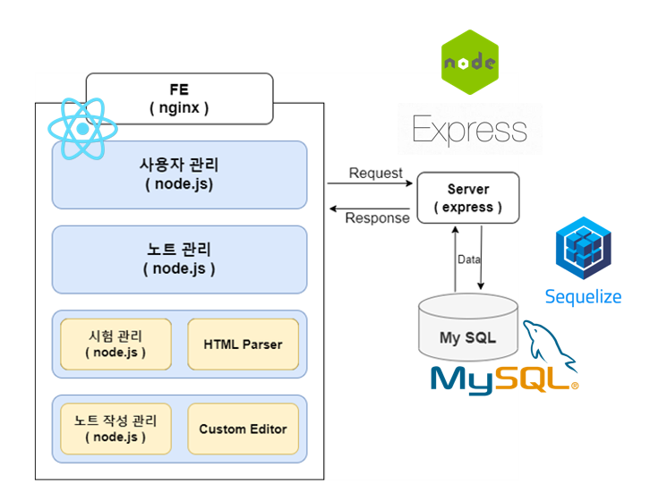

안녕하세요, 팀 Limit Sigma Crow(LΣC)에서 개발한 **N2T** 개발 과정을 이야기 해보겠습니다.

저희 팀은 대학 Capstone Project를 위해 모인 팀으로 4인의 Web 개발자로 구성되어 있습니다.

 

# N2T?

N2T는 Note to Test라는 의미로 노트 필기를 시험문제로 변환해주어 개인이 학습한 내용을 보다 쉽게 학습할 수 있게 제공해주는 서비스 입니다.

 

# Develop

저희 웹에서 제공하는 서비스는 다음과 같습니다.

- 인증 기능
	- 회원 가입
	- 로그인 ( Oauth 제공)
- N2T
	- 튜토리얼
	- 노트 공유 및 검색 기능 제공
	- 마크다운 에디터 제공

 

## 서비스 구상도

 

## 개발 문서
[웹 개발 저장소 보러가기](https://github.com/sigma-crow/n2t/wiki)

[개발 문서 보러 가기](https://github.com/sigma-crow/n2t/blob/dev/%EC%B5%9C%EC%A2%85%EB%B3%B4%EA%B3%A0%EC%84%9C_%ED%8C%80L%CE%A3C%20-%20%EA%B3%B5%EA%B0%9C%EC%9A%A9.pdf) 개발 문서에 더 많은 기록과 정보가 작성되어 있습니다.

 

# 느낀 점

소프트웨어공학과로서 소프트웨어 공학적인 부분에 대한 여러 산출물을 만드는 데 집중하였다. 개발 문서에 보면 상당히 보기 싫은 그래프와 표가 잔뜩 있는 것을 알 수 있듯 설계를 열심히 했던 프로젝트이다.

 

## 어려웠던 점
Markdown에서 내가 원하는 Custom Tag를 추가하기 위한 로직을 변경했다. 사실 아직도 어렵고 아직도 헷갈리는 부분이 있는데 원하는 부분을 얻기 위해서 소모한 시간이 너무 크다는 것이 크나큰 아쉬움이었다.

 

## 아쉬운 점
너무너무 아쉬운 점이 하나 있다면 'GPU 서버를 하나라도 구했다면'이라는 아쉬움이 남는다. 첫 계획에서는 ML/DL을 통한 서비스를 구상하고 싶었기 때문이다. 하지만 GPU 서버는커녕 웹서버를 구동할 자원 또한 없었기에 약간은 다른 방법으로 구성하였다.

다음으로 아쉬운 점은 OCR 기능에 대한 부분이다. 물론 개발 일정에 시간이 부족하기도 하였으나 이뿐만 아니라 단순 OCR로는 현 기능을 이용하기에는 무리가 있다. 먼저 Markdown 형식만을 지원하는 상태이므로 이를 OCR 하기에는 개발 일정을 맞추기 너무 어려웠기 때문도 있고 사용자 경험에 절대 좋은 경험을 줄 거로 생각할 수 없기 때문이다.

디자인에 대한 아쉬움 또한 있다. UX/UI에 대한 고려를 진행하지 못하였다. 디자인을 개발자들끼리 직접 하려 하여 좀 더 아쉬움이 있다는 생각이 든다.

 

# 부록

