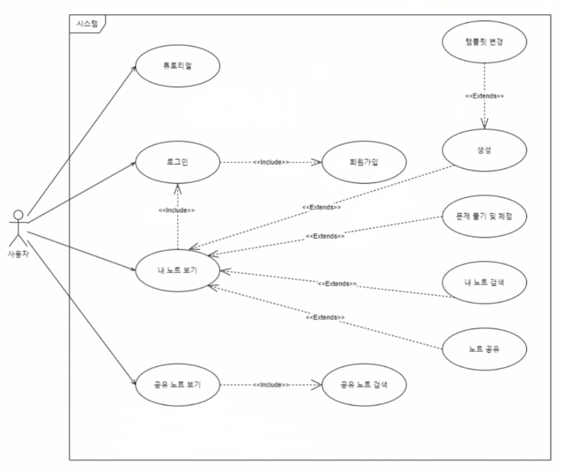

# [Github 바로가기](https://github.com/sigma-crow/n2t)

 

# N2T

N2T(Note to Test)는 대학 Capstone Project의 일환으로 4명의 Web 개발자로 구성된 팀이 진행한 프로젝트입니다. 노트 필기를 문제로 변환하여 보다 효과적인 학습을 지원하는 것을 목표로 하였습니다.

자세한 내용은 [GitHub](https://github.com/sigma-crow/n2t) 및 [최종 보고서](https://github.com/sigma-crow/n2t/blob/dev/%EC%B5%9C%EC%A2%85%EB%B3%B4%EA%B3%A0%EC%84%9C_%ED%8C%80L%CE%A3C%20-%20%EA%B3%B5%EA%B0%9C%EC%9A%A9.pdf)에서 확인할 수 있습니다.

 

---

 

## 서비스 영상

 

---

 

## 개발 배경

'자동화'는 생산성 향상에 큰 기여를 하였으며, 학습 시간을 단축하는 방법을 고민하였습니다.  
시험 효과와 인출 효과를 활용할 수 있는 **모의 테스트**를 도입하고, 사용자의 학습 내용을 기반으로 자동으로 시험 문제를 생성하는 시스템을 설계하였습니다.

 

---

 

## 개발 목표

사용자가 작성한 문서를 기반으로 학습 효과를 극대화하는 것을 1차 목표로 하였습니다.

 

### 핵심 기능

1. **문서 편집 환경 제공** - 사용자가 자유롭게 문서를 기록할 수 있도록 지원
2. **자동 문제 생성** - 문서를 분석하여 시험 문제를 출제
3. **시험 응시 및 채점** - 사용자가 시험을 응시하고 결과를 즉시 확인할 수 있도록 구현
4. **유저별 데이터 관리** - 시험 기록을 저장하고 분석할 수 있도록 로그인 기능 제공

 

### 제공 서비스

- **인증 기능**
  - 회원 가입
  - 로그인 (OAuth 지원)
- **N2T 서비스**

  - 튜토리얼 제공
  - 마크다운 기반 에디터 제공
  - 시험 응시 및 자동 채점 기능

 

---

 

## 내가 맡은 역할

팀장으로서 아이디어 기획을 주도하였으며, **FE(Front-End) 개발 전반을 설계**하였습니다.  
특히 **마크다운 문법을 커스텀**하여 N2T의 핵심 기능 로직을 구현하는 데 집중하였습니다.

 

---

 

## 얻은 경험

Capstone Project의 특성상 소프트웨어 공학적 산출물 작성에 많은 시간을 투자했습니다.  
이를 통해 꼼꼼한 설계와 기획이 프로젝트 진행에 미치는 영향을 체감할 수 있었습니다.

 

### 모델 개발의 어려움

초기 목표는 보다 고도화된 모델을 구축하는 것이었습니다.

- **Fine-tuning 기반 문제 생성 모델** 개발
- **객관식 및 서술형 채점 기능** 적용

그러나 **성능 문제**와 **GPU 서버 비용 부담**으로 인해 최종적으로 만족할 만한 모델을 완성하지 못했습니다.

 

### ChatGPT와의 비교

프로젝트 종료 직후, **ChatGPT의 급부상**을 경험했습니다.  
ChatGPT의 성능이 기대 이상으로 뛰어났으며, 당시 이를 서비스에 활용하지 못한 점이 아쉬움으로 남았습니다.
