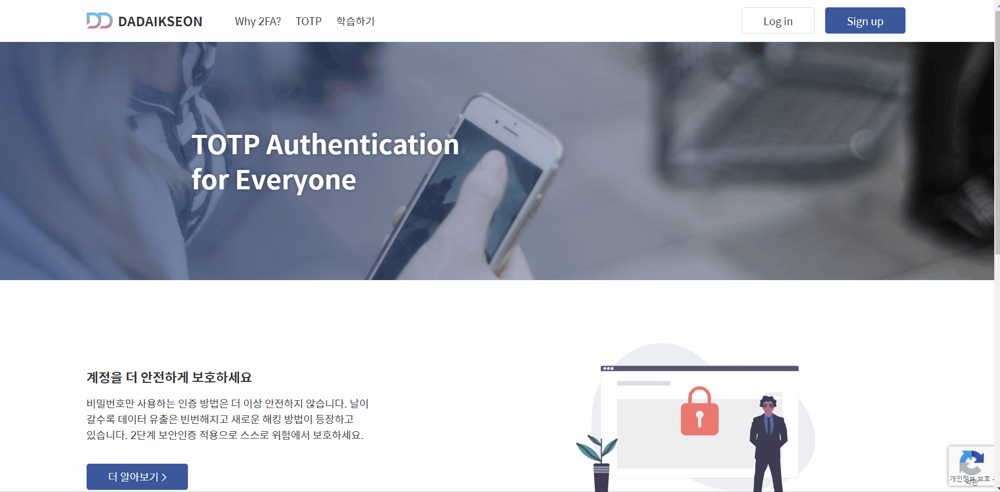

# **[GitHub 바로가기](https://github.com/boostcamp-2020/Project03-A-TOTP)**

 

---

 

# TOTP

## 프로젝트 소개

**TOTP**는 Naver BoostCamp WEB & Mobile 5기 최종 프로젝트로, 5명의 개발자가 협업한 팀 프로젝트입니다.
이 프로젝트는 **이중 인증(TOTP, Time-based One-Time Password)에 대한 학습과 구현**을 목표로 진행되었습니다.

사용자는 TOTP를 활용한 **보안 인증**을 경험할 수 있으며, TOTP의 생성 및 활용, 인증 과정, 그리고 사용자 계정 관리 등의 기능을 직접 구현해보는 것이 핵심 목표였습니다.

자세한 내용은 [GitHub](https://github.com/boostcamp-2020/Project03-A-TOTP) 및 [개발 문서](https://github.com/boostcamp-2020/Project03-A-TOTP/wiki)에서 확인할 수 있습니다.

 

---

 

## 서비스 기능

### 회원가입

### 로그인 & 로그아웃

### 아이디 찾기

### 비밀번호 변경

### 내 정보 변경

### 접속 기록 조회 & 로그인 상태 만료

### 학습 페이지 & 학습 퀴즈

 

---

 

## 개발 배경

대부분의 웹 서비스는 **로그인 및 인증 과정**을 포함하고 있으며, 이를 안전하게 보호하는 것이 매우 중요합니다.
이 프로젝트에서는 기본적인 로그인 시스템에 **TOTP 기반의 이중 인증**을 추가하여 보안성을 강화하는 것을 목표로 삼았습니다.

이를 통해 단순히 아이디/비밀번호 방식이 아닌 **추가적인 인증 수단을 도입하여 사용자 계정을 보호**하는 방식에 대해 깊이 있게 고민할 수 있었습니다.

 

---

 

## 개발 목표 및 핵심 기능

 

### 개발 목표

- **로그인 시스템 설계 및 구현**
- **TOTP 기반의 이중 인증 기능 추가**
- **사용자 계정 관리 기능(아이디/비밀번호 찾기, 변경 등) 구현**
- **접속 기록 조회 및 세션 만료 기능 제공**
- **TOTP 생성 어플리케이션과의 연동**

 

### 핵심 기능

1. 회원가입 / 로그인 / 로그아웃
2. TOTP를 활용한 이중 인증 적용
3. 아이디 및 비밀번호 찾기, 변경 기능
4. 사용자 접속 기록 관리 및 세션 만료 처리
5. QR 코드 기반의 TOTP 앱 연동

 

---

 

## 맡은 역할

이번 프로젝트에서 저는 **웹 서버 및 API 개발, 프론트엔드 일부 기능 구현**을 담당하였습니다.

### 주요 업무

- **Sequelize ORM 기본 세팅 및 DB 설계**
- **Redis 설정 및 세션 관리 기능 개발**
- **이메일 발송 API 구현 (비밀번호 찾기 & 인증 이메일 전송)**
- **Redis를 활용한 만료 처리 구현**
- **iOS 앱과 연동되는 API 개발**
- **아이디 찾기 기능 및 관련 페이지 개발**
- **QR 코드 생성 및 UI 리팩토링**

 

---

 

## 얻은 경험

### 1. **백엔드와 프론트엔드 개발 경험**

이번 프로젝트를 통해 **Node.js 기반 서버 개발**과 **React 기반의 프론트엔드 개발**을 모두 경험할 수 있었습니다.
이전에는 한쪽만 집중적으로 다뤄본 경험이 많았는데, **전체적인 웹 서비스 개발 과정**을 경험하면서 더 넓은 시야를 가질 수 있었습니다.

 

### 2. **Typescript 도입과 학습**

프로젝트에서 처음으로 **Typescript**를 사용했는데, **코드의 안정성과 가독성이 크게 향상**된다는 점이 좋았습니다.
정적 타입을 통해 사전 오류를 방지할 수 있어 **개발 생산성이 향상**됨을 체감할 수 있었습니다.

 

### 3. **Redis를 활용한 세션 관리**

Redis를 활용하여 **사용자 세션을 관리**하는 기능을 구현하면서,
Key-Value 기반 데이터 저장 방식이 **어떤 이점이 있는지** 직접 경험할 수 있었습니다.
또한, **세션 만료 및 데이터 캐싱 기법**에 대한 이해도를 높일 수 있었습니다.

 

### 4. **Swagger를 활용한 API 문서화**

Swagger를 이용하여 API 문서를 작성하면서, 문서화가 개발 과정에서 **얼마나 중요한지** 실감할 수 있었습니다.
팀원 간 원활한 협업이 가능해졌으며, 클라이언트와 서버 간의 **의사소통 비용을 줄이는 데 큰 도움이 되었습니다.**

 

### 5. **도전과 성장**

이 프로젝트를 통해 **새로운 기술을 배우고 적용하는 것에 대한 자신감**을 얻었습니다.
처음에는 어렵게 느껴졌던 기술들도 직접 구현하고 개선해 나가면서, **도전하면 해결할 수 있다**는 경험을 쌓을 수 있었습니다.
