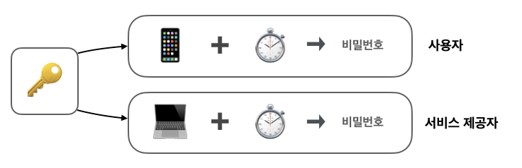
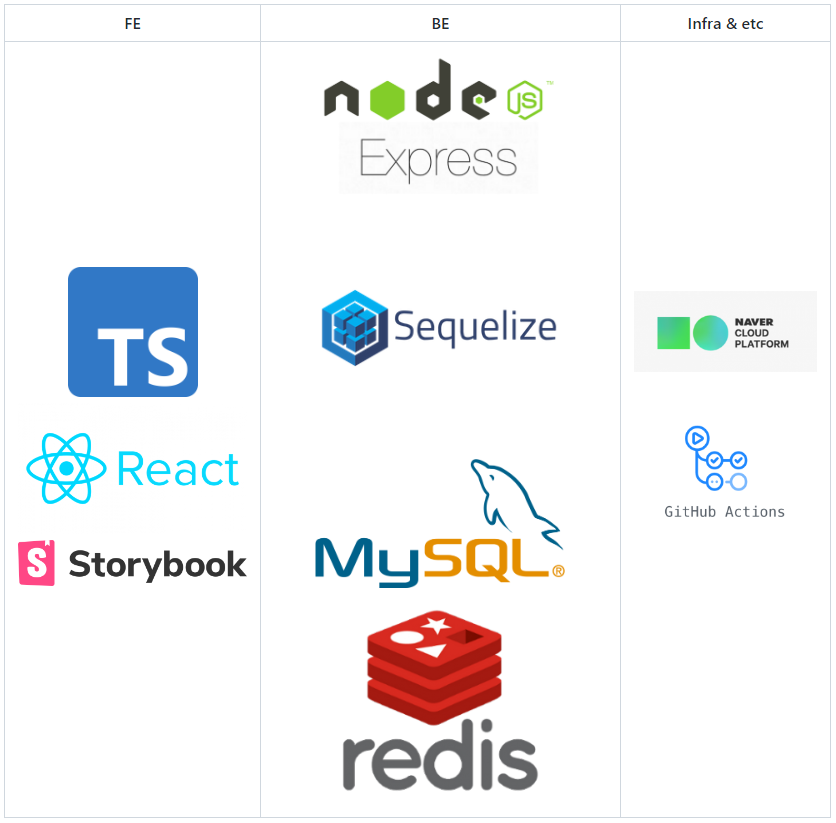
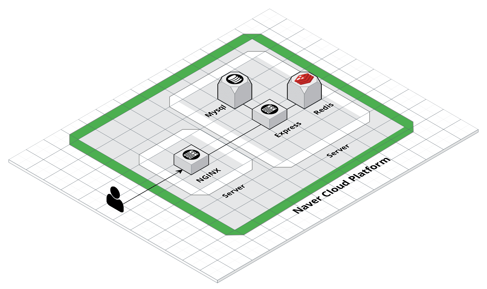

안녕하세요, 팀 TOTP가 뭐조에서 개발한 **DaDaIkSeon**을 개발 과정을 이야기 해보겠습니다.

저희 팀은 Naver BoostCamp Web&Mobile 5기에서 만난 팀으로 Web 개발자 3인 IOS 개발자 2인으로 구성되어 있습니다.

오늘은 제가 진행한 Web FullStack 개발 과정에 대해서 이야기 해보겠습니다.

 

# TOTP란?

## Two Factor Authentication(2FA)

먼저 TOTP를 이해하기 앞서 먼저 2FA에 대해 간단하게 이해할 필요가 있습니다. 이는 말 그대로 2번 이상의 인증을 받는 것을 뜻합니다.
TOTP는 두번째 인증을 위한 두 번째 비밀번호라고 할 수 있습니다.

**그렇다면 왜 2FA를 해야할까요?**

사용자를 인증하는 수단은 여러가지가 있습니다. 그 중 3가지 요소는 다음과 같습니다.

1. 정보 - 비밀번호, 핀 번호
2. 소유물 - 인증카드, 스마트폰
3. 생체 - 지문 얼굴

대부분의 사람들은 1번의 비밀번호를 통해 사용자를 인증하고 로그인하게 됩니다. 하지만 아마도 우리는 많은 곳의 인증 정보를 쉽게 기억하기 위해 비밀번호를 똑같이 하고 있지 않나요?

약 39%의 사람들은 다른 사이트에서 같은 비밀번호를 사용한다고 합니다. 만약 다른 사이트가 해킹을 당해 비밀번호가 유출된다면 그 사이트만의 문제는 아니게 될 것 입니다.

그래서 2FA는 필요합니다. 이중 우리는 TOTP를 통해 2FA를 하고자 했습니다.

 

## TOTP (Time-based One-Time Password)

TOTP는 현재 시간과 Secret Key 값을 사용하여 생성된 정보로 이를 비밀번호로 사용하게 됩니다. 사용자와 웹사이트가 동일한 Secret Key를 가지고 있다면 같은 시간때에서 같은 비밀번호를 가지게 됩니다.

따라서 사용자는 이 Secret Key를 저장할 수단이 필요하고 이는 전용 OTP기기를 사용하거나 스마트폰을 사용하여 저장합니다.

중요한것은 이 TOTP에서 우리가 입력한 비밀번호는 일회성이며 시간에 따라 효력이 사라지기 때문에 더욱 안전합니다.

 

# Develop

[저장소 보러가기](https://github.com/boostcamp-2020/Project03-A-TOTP) / [어플 다운받기](https://apps.apple.com/kr/app/%EB%8B%A4%EB%8B%A4%EC%9D%B5%EC%84%A0-totp/id1544069234) / [웹사이트](https://dadaikseon.com/)

따라서 저희는 **TOTP 인증 앱**, 그리고 **TOTP 로그인을 제공하는 웹 사이트** 이렇게 2가지를 개발하였습니다.

 

**Web**

[웹 개발 저장소 보러가기](https://github.com/boostcamp-2020/Project03-A-TOTP/tree/master/WEB)

저희 웹에서 제공하는 서비스는 다음과 같습니다

- 인증 기능
	- 회원 가입
	- 로그인(TOTP 2차인증)
	- 로그아웃
- 편의 기능
	- 아이디 찾기
	- 비밀번호 변경하기
	- QR코드 재발급(TOTP 비밀키 재발급)
	- 개인정보 수정
- 접속 기록 관리(세션 관리)
	- 접속 기록 조회
	- 로그인 상태 만료
- 학습 기능
	- 2FA, TOTP 학습 페이지
	- 학습 퀴즈 페이지

 

## Tech Stack
먼저 저희가 사용한 기술 스택은 다음과 같습니다.

 

## Architecture

 

## 개발 문서

[개발 문서 보러 가기](https://github.com/boostcamp-2020/Project03-A-TOTP/wiki) 개발 문서에 약 4주간의 더 많은 기록과 정보가 작성되어 있습니다.

 

# 배운 점

사실 여기 전부 나열할 수 없을 만큼 배운 점이 많다. 특히 Typescript를 처음 사용하였기 때문에 쉽지 않던 도전이었지만 오히려 더 많은 것을 배우는 좋은 기회였다.

또한 그동안 개발을 한다는 것은 해당 기능이 잘 작동하는지에만 관심이 있었다. 하지만 이번에 웹사이트에서 행하는 기본적인 공격에 대한 방어를 어떻게 진행하는지에 이해도 병행할 수 있었다.

 

## 사용자 인증

사용자 인증하는 개발을 이전에는 진행하지 않았다. 사실 못했다고 말하는 게 더 정확할지도 모른다. 

사용자를 인증하는 과정은 어떻게 보면 정말 간단하게 보일지도 모른다. 하지만 로그인 페이지를 구성하면서 고려해야 하는 점이 한두 가지가 아니였다. 그 흔한 이메일 인증을 진행해보는 것조차 나에게는 정말 큰 도전이었고 어려움이었다.
로그인을 구현하면서 필요한 여러 정보 특히 이메일 인증 등의 방법은 전혀 무지한 상태에서 진행하였다. 우리만의 방식으로 인증을 진행해보고자 노력하였고 우리가 기존에 이용하던 사이트에서 보이는 방식을 모방하였다.

로그인을 성공적으로 한 이후 할 게 더 많았다. 우선 사용자를 한번 인증했다고 그것이 전부는 아니니까... 사용자 정보를 어떻게 저장할지 어떤 게 더 좋은 건지 학습하고 직접 구현해보는 시간을 가지면서 각각의 방식에 대해 이해를 했다.

 

## 성능
사실 성능에 대한 부분이 뛰어나거나 최적화를 완벽하게 했다고 할 수는 없다. 그럼에도 불구하고 성능을 위해 많은 노력을 하였다. 그중 session을 위한 DB를 따로 두는 것이 또 하나의 도전이었다. Redis를 사용하는 것은 처음이었고 사실 아직도 Redis를 잘 쓴다고 할 수 없지만, 사용의 이유와 원리에 대해 배운 것 같다.

 

## 효율적인 개발을 위한 Tool
사실 이전에는 잘 모르기도 하였지만, 학습의 두려움과 그 편의성을 알지 못해 전혀 사용하지 않았다. 물론 Git wiki에 이렇게 기록을 열심히 한 것 또한 처음이었다. 개발에 있어서 기록을 위한 공간과 협업을 위한 Tool의 중요성을 느끼고 또 이를 활용하여 이 편의성을 직접 느꼈다는 점이 너무 좋았다. 특히 API 문서를 작성할 때 Swagger는 너무나도 편리한 도구 중 하나였다.

 

## 하면 된다
사실 이 프로젝트가 나에게 정말 큰 의미를 주는 것은 하면 된다는 것이었다. 물론 이전에도 여러 프로젝트를 진행하고 했지만 내가 느꼈던 부분은 새로운 기술과 새로운 도구에 대한 부분이다. 항상 새로운 기술과 도구를 사용하는 것을 귀찮아했고 두려워하기도 하였다. 하지만 이번 프로젝트를 하면서 새로운 기술과 도구를 사용하는 것에 대한 두려움을 많이 줄여 한층 더 성장할 수 있는 발판이 되었다고 믿는다.

혼자하는 개발이 아닌 팀원과 함께하는 개발이라는 것이 너무나도 좋았고 좋은 경험이였다.

 

# 부록

**회원가입**

 

**로그인 & 로그아웃**

 

**아이디 찾기**

 

**비밀번호 변경**

 

**내 정보 변경**

 

 **접속기록 조회 & 로그인 상태 만료 기능**

 

**학습페이지 & 학습 퀴즈**
