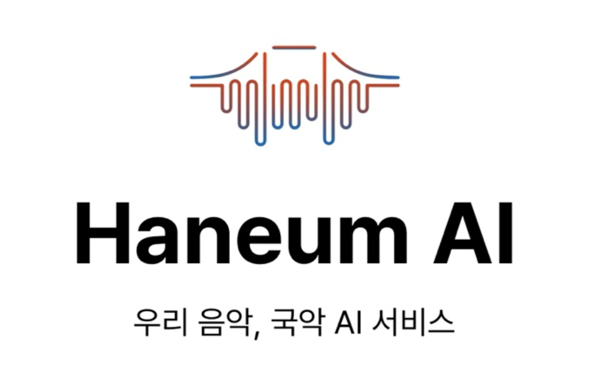

# [Github 바로가기](https://github.com/bonomoon/haneum-ai-app)

# HaneumAI

**2024 Epson Innovation Challenge in Korea** 출품을 위한 프로젝트로, 국악의 세계화에 큰 걸림돌이 되는 **정간보를 오선보로 변환**하는 것을 목표로 시작했습니다.

자세한 내용은 [GitHub](https://github.com/bonomoon/haneum-ai-app) 또는 별도로 전달된 **첨부파일**에서 확인할 수 있습니다.

## 서비스 영상

<video width="100%" height="auto" controls>
  <source src="https://github.com/mon823/mon823.github.io/blob/master/src/markdown-pages/develop/Project/assets/develop-haneum/1.mp4?raw=true" type="video/mp4">
</video>
