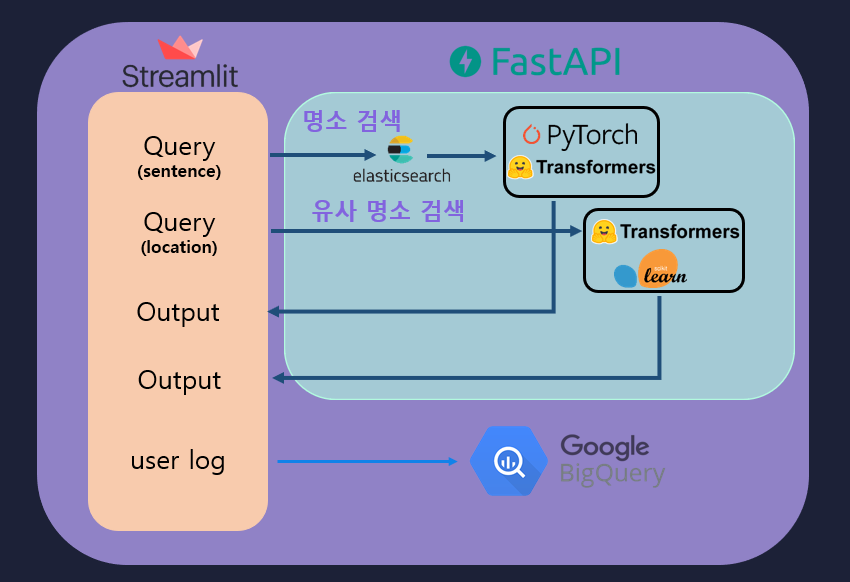
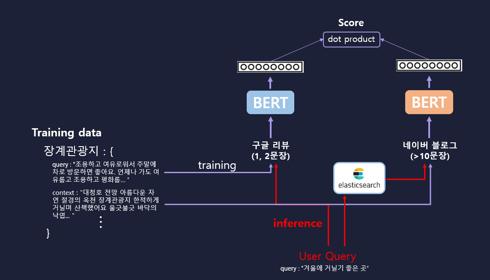
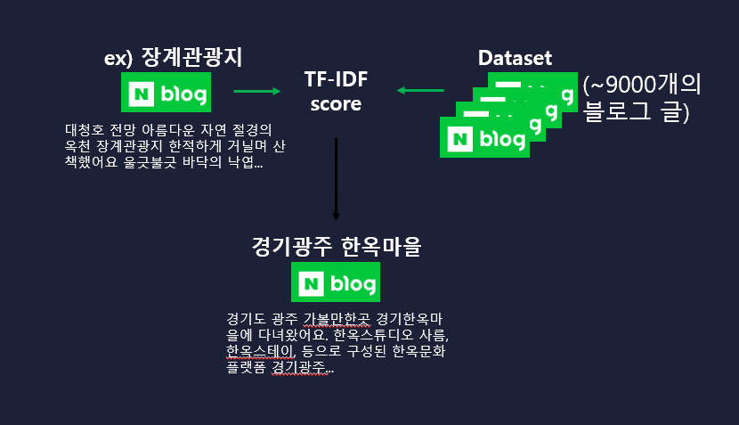

안녕하세요, 팀 AI-ESG에서 개발한 **저기어때**의 개발 과정을 이야기를 해보겠습니다.

저희 팀은 Naver BoostCamp AI Tech 2기에서 만난 팀으로 총 7명으로 구성되어 있습니다.

 

# 저기어때!

저기어때는 사용자가 원하는 장소를 묘사하면 특정 관광지 또는 유사한 다른 장소를 추천해주는 서비스이다.

 

# Develop

저희 웹에서 제공하는 서비스는 다음과 같습니다.

- 검색
	- 문장으로 묘사하는 검색 제공
	- 세부정보 제공
		- naver place의 정보 및 링크 제공
	- 결과에 대한 반응 수집

 

**Service Flow**

 

**명소 검색**

 

**유사 명소 검색**

 

## WEB

간단하게 프로토타이핑 도구를 통해 WEB을 구성하고 이를 통해 서비스를 보여줄 수 있는 공간으로 **streamlit**을 활용 하였다.

python으로 간단하게 빌드 할 수 있다는 장점이 있다.

lode balancing을 하기위해 nginx의 기능을 활용하였다.

 

## ML/DL

### 데이터 수집

먼저 관광지의 데이터를 가져오기 위해서 아래 3가지 데이터를 활용하였다.

- 한국관광공사 공식 Open API
- 네이버 Place 데이터
- Google Place 데이터

우선 한국관광공사 Open API의 데이터를  통해서 한국에 있는 관광지 이름을 구하는 것을 먼저 진행하였다.

해당 관광지 리스트를 통해서 네이버 Place와 Goole Place의 사용자 리뷰 데이터를 먼저 취합하였다. 사용자 리뷰 데이터를 수집하여 사용자가 해당 장소에 대한 묘사부터 감정, 서비스까지 확인할 수 있다고 생각하였다.

 

### 모델 선택 및 최적화
[실험 문서 보러가기](https://github.com/boostcampaitech2/final-project-level3-nlp-11/wiki/%EC%8B%A4%ED%97%98%EC%9D%BC%EC%A7%80)

 

# 느낀 점

ML/DL 모델을 서빙하는 방식에 대해서 정말정말 간단하게만 진행해보았다. 또한 ML/DL에 대해 어떻게 모델을 최적화하고 해당 모델을 이용해야 하는지에 대해 경험을 했다는 점이 좋았다.

물론 아직도 나에게 어려운 점이 너무 많다. 우선 데이터를 수집하는 것 그리고 모델을 선택하고 최적화하기 위한 수 많은 지식이 필요했다는 점이 크다. 해당 모델의 성능을 올리기 위해 해볼 수 있는 것도 정말 다양하고 많다는 것이 더욱 공부를 진행해야 하는 이유로 느껴졌다.

아직도 모델을 훈련하고 이용하는 게 어렵게 느껴지지만 이러한 경험이 분명 도움이 되리라 믿는다.

 

# 부록

